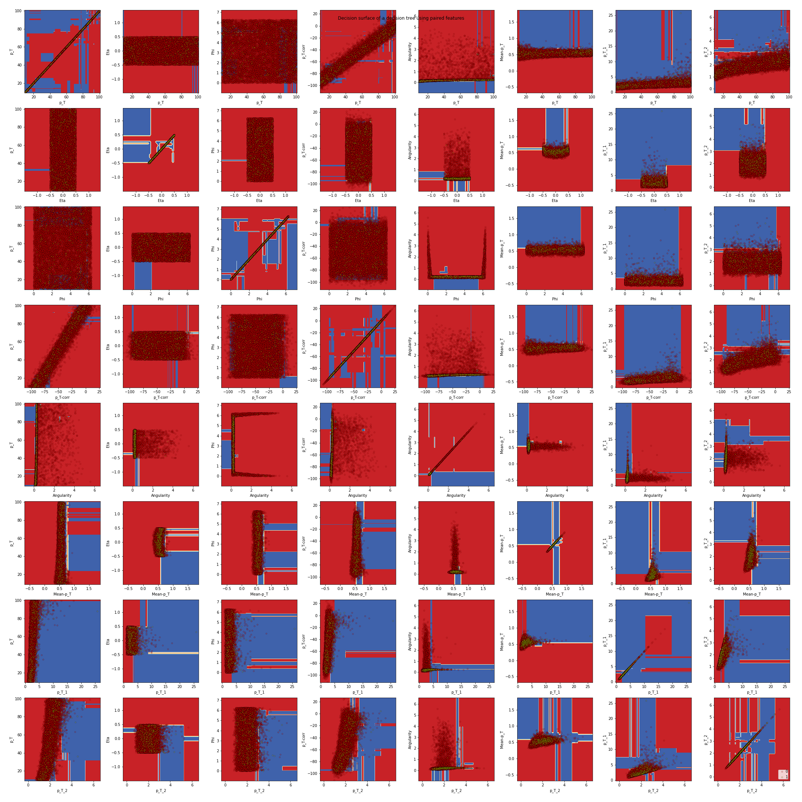

# ML-Jet-BG-Subtraction
C++ scripts for generating a realistic Jet event and python scripts for a machine learning solution to BG subtraction

# Installation
## Prerequisites
The generator code requires ROOT 5 which can be found [here](https://root.cern.ch/releases). Installation instructions are cryptic, but I would look [here](https://root.cern.ch/building-root) for info about that. Good luck!

The code also requires Pythia 6 which is included in the git, but there is no explicit gauruntee that it will properly connect with your system. We recommend looking at the maindriver_newton.C file in Analysis_Code/Generator to fix any user-specific filepaths.

The machine learning requires python3 and a couple of libraries that can be installed via pip

`pip3 install pandas matplotlib numpy sklearn`

# Results
Here is a sample result, we will add more in the future.

To see the output of TennGen+Pythia, check out [this](https://drive.google.com/drive/folders/1n0zZEA8bxsG3f3RuCkfeOY0ayOyVr0RA?usp=sharing) Google Drive and request access from [chughe26@vols.utk.edu](chughe26@vols.utk.edu)

# A word about the code:

What does each component actually do? Be as specific as possible while at the same time being brief. 

### ML Working Doc

This notebook performs all the Machine Learning on data outputted from the Generator. We can break down the activities into steps:

1) Retrieve data from csv.
    Reads data out from csv into a pandas DataFrame.

2) Prepare the data for Machine Learning.
    2a) Ensure each feature is the proper type
    2b) Add calculated features
    2c) Label the data for classification
    2d) Drop ineffective features
    2e) Split the data into a train and test set
    2f) Split the train and test sets into training and testing feature sets and label sets

3) Visualize basic features.
    3a) Describe feature statistics
    3b) Visualize distribution of labeling feature
    3c) Visualize distributions for each class and each feature
    3d) Visualize corellations between features

4) Apply Machine Learning Algorithms.
    4a) Apply basic Decision Tree to data as naive baseline model
    4b) Display feature importances
    4c) Apply a GridSearchCV to hyperparameters of Random Forest Classifier to find best hyperparameter configuration
    4d) Display Feature Importances for the best hyperparameters
    4e) Visualize Oracle Decision Tree
    4f) Visualize Decision Boundaries
    4g) Visualize t-SNE 2d plot

