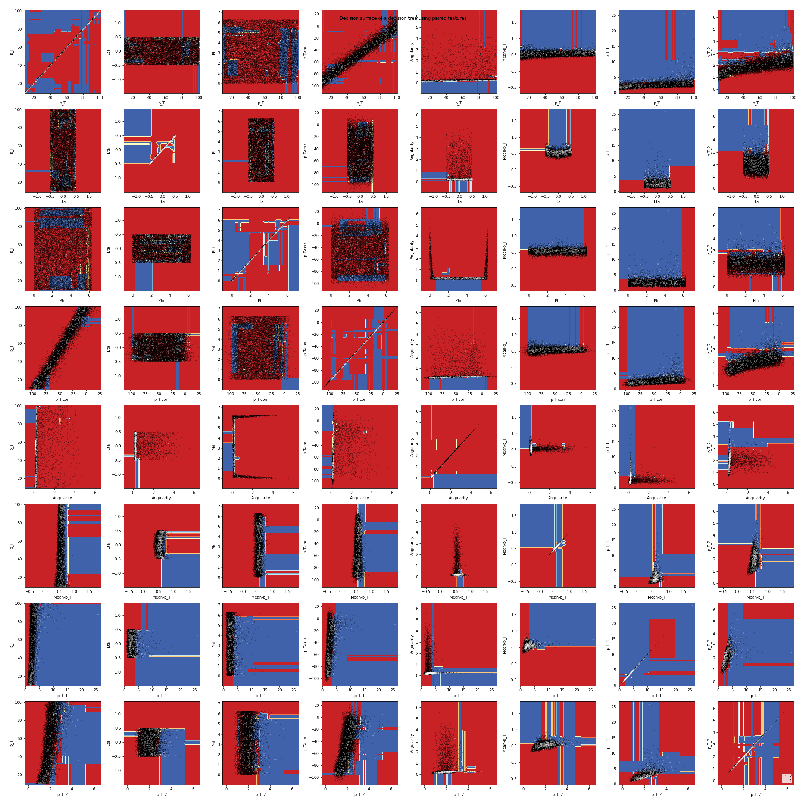

# ML-Jet-BG-Subtraction
C++ scripts for generating a realistic Jet event and python scripts for a machine learning solution to BG subtraction

# Installation
## Prerequisites
The generator code requires ROOT 5 which can be found [here](https://root.cern.ch/releases). Installation instructions are cryptic, but I would look [here](https://root.cern.ch/building-root) for info about that. Good luck!

The code also requires Pythia 6 which is included in the git, but there is no explicit gauruntee that it will properly connect with your system. We recommend looking at the maindriver_newton.C file in Analysis_Code/Generator to fix any user-specific filepaths.

The machine learning requires python3 and a couple of libraries that can be installed via pip

`pip3 install pandas matplotlib numpy sklearn`

# Results
Here is a sample result, we will add more in the future.

To see the output of TennGen+Pythia, check out [this](https://drive.google.com/drive/folders/1n0zZEA8bxsG3f3RuCkfeOY0ayOyVr0RA?usp=sharing) Google Drive and request access from [chughe26@vols.utk.edu](chughe26@vols.utk.edu)

# A word about the code:

What does each component actually do? Be as specific as possible while at the same time being brief. 

### ML Working Doc

This notebook performs all the Machine Learning on data outputted from the Generator. We can break down the activities into steps:

<ol>
<li> Retrieve data from csv.
    <ol>
    Reads data out from csv into a pandas DataFrame.
    </ol>
    </li>
</ol>
<ol>
2) Prepare the data for Machine Learning.
<ol>
    <li> Ensure each feature is the proper type</li>
    <li> Add calculated features</li>
    <li> Label the data for classification</li>
    <li> Drop ineffective features</li>
    <li> Split the data into a train and test set</li>
    <li> Split the train and test sets into training and testing feature sets and label sets</li>
</ol>
</ol>

<ol>
3) Visualize basic features.
    <ol>
    <li> Describe feature statistics</li>
    <li> Visualize distribution of labeling feature</li>
    <li> Visualize distributions for each class and each feature</li>
    <li> Visualize corellations between features</li>
    </ol>
</ol>

<ol>
4) Apply Machine Learning Algorithms.
    <ol>
    <li> Apply basic Decision Tree to data as naive baseline model</li>
    <li> Display feature importances</li>
    <li> Apply a GridSearchCV to hyperparameters of Random Forest Classifier to find best hyperparameter configuration</li>
    <li> Display Feature Importances for the best hyperparameters</li>
    <li> Visualize Oracle Decision Tree</li>
    <li> Visualize Decision Boundaries</li>
    <li> Visualize t-SNE 2d plot</li>
    </ol>
</ol>
